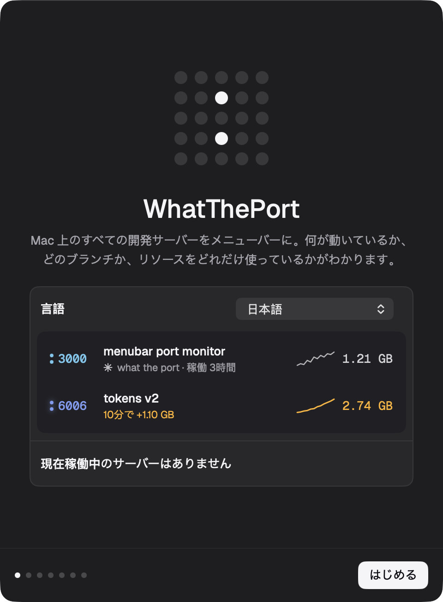

# Dev Servers

Native macOS menu-bar app for local dev servers, LaunchAgents and LAN devices. This is a fork of [WhatThePort](https://github.com/tomjohndesign/what-the-port) by [Tomjohn](https://tomjohn.design), MIT. It keeps WhatThePort’s scanner, leak alerts, Clean up, agent sessions and `wtp`, and adds the helpers, noise rules and LAN discovery needed to replace the Electron [Dev Servers](https://github.com/allesistalles/dev-servers) app.

The app’s display name is **Dev Servers**. Bundle id: `website.vibed.devservers`. The website download stays [`/WhatThePort.dmg`](https://whattheport.dev/WhatThePort.dmg).

**Every dev server on your Mac, in the menu bar.**

What it is, what branch it’s on, which agent started it, and what it’s costing you. Stop the ones you forgot about in one click.

[**Download for macOS**](https://whattheport.dev/WhatThePort.dmg) · [Try the interactive demo](https://whattheport.dev) · [Guides](https://whattheport.dev/guides) · [Build from source](#building)

Free and open source · macOS 14 or later · No account

[](https://whattheport.dev)

## Know what’s running

WhatThePort is a native Swift app that lives in your menu bar, with no Dock icon. Press **⌥⌘P** to see your local development servers: project names, ports, git branches, uptime, and resource use. Open a server in your browser, inspect its processes, or stop and restart it without hunting through terminals.

### Knows which agent started it

Servers launched by Claude Code, Codex, or Conductor link back to the session that started them. Pick up the conversation, check the branch, or open a Vercel preview. Optional pull request links use the GitHub CLI you’re already signed in to.


### Notices before your fans do

When a server passes the default 2 GB memory threshold or grows more than 500 MB in ten minutes, WhatThePort turns its menu bar amber and sends a notification. Port colors stay consistent, while amber memory readings flag servers needing attention. Ten minutes of memory and CPU history show what’s happening across the whole process tree. Adjust thresholds and snooze alerts in Settings.


### Stops the ones you forgot

**Clean up** adds checkboxes to the server list and preselects servers from deleted worktrees or idle for hours. Tick the ones to go and WhatThePort stops each whole process tree. Database processes such as Postgres and Redis are protected by default.

Choose **Off**, **Ask**, or **Automatic** cleanup in Settings. Leaking servers are never stopped automatically.


*Screenshots from the [marketing site’s interactive demo](https://whattheport.dev), using sample server data.*

## Get started

1. [Download WhatThePort](https://whattheport.dev/WhatThePort.dmg) and open it.
2. Drag **WhatThePort** onto the **Applications** shortcut beside it, then open it from Applications.
3. Start a development server, then click the dot grid in your menu bar or press **⌥⌘P**.

The prebuilt download is for **Apple Silicon Macs running macOS 14 or later**. To compile the app yourself, you’ll also need **Swift 5.9+**.

## Features

- **Every dev server at a glance** - Port, project, git branch, uptime and memory for each server, with stable port colors and a whole-Mac memory bar for servers, other apps, and free RAM
- **Knows what started it** - Links servers to the Claude Code, Codex or Conductor session that launched them
- **Resource charts** - 10 minutes of memory and CPU history per server, summed across its whole process tree
- **Leak detection** - Servers over 2 GB, or growing fast, turn amber in the list and the menu bar
- **Clean up** - Find servers from deleted worktrees or that have gone idle, and stop them in bulk
- **Stop and restart** - Stops the whole process tree; restart reruns the original command in the same folder
- **Alerts** - Notifications with Details, Stop and Snooze when a server passes your memory threshold or starts leaking
- **Automatic clean up (optional)** - Off, Ask or Automatic; leaking servers are never stopped automatically
- **Previews and pull requests (optional)** - A Vercel preview button and the branch's pull request, via the GitHub CLI you're already signed in to
- **Automatic updates** - Signed updates download in the background and install when you quit; controls and manual checks in Settings → About
- **Global shortcut** - ⌥⌘P opens the popover
- **Terminal UI** - `wtp` shows the same servers, details and Clean up in your terminal
- **Light and dark mode** - Follows your Mac’s appearance, with matching port numbers and colon colors

## Usage

WhatThePort lives in the menu bar as a small dot grid. Click it to see every server:

- Hover a row to open it in the browser or stop it
- Click a row for details: session, branch, folder, command, charts and processes
- Click **Clean up** to tick the servers you want gone and stop them together

Right-click the dot grid to open a server in the browser, open Settings, check for updates, send feedback or quit.

Can't see the dot grid? The menu bar hides icons that don't fit: click » at its edge on macOS 27, or check **System Settings → Menu Bar**. Opening WhatThePort again from Finder or Spotlight shows the popover, or Settings when the icon is hidden.

### In the terminal

`wtp` opens the same server list in your terminal, using the app's scanner and settings. Onboarding offers to install it, or click **Install…** in **Settings → General → Terminal**. That links `/usr/local/bin/wtp` to the app, asking for your password if the folder needs it, and keeps working through updates. To link it yourself:

```bash
sudo mkdir -p /usr/local/bin
sudo ln -sf "/Applications/Dev Servers.app/Contents/MacOS/WhatThePort" /usr/local/bin/wtp
```

- `↑` `↓` to select, `⏎` for details, `space` for an Actions menu (open, restart, stop, resume the agent session, editor, copy), `c` for Clean up, `?` for every key
- Every action also has its own key, such as `o` to open, `r` to restart and `s` to stop; in details, `i` shows more info and `p` shows processes
- Click rows and scroll with the mouse
- `wtp list` prints the servers and exits; `wtp list --json` prints them as JSON for scripts and agents

`wtp` follows your terminal's colors and leaves notifications and automatic clean up to the menu bar app. Memory and CPU charts fill in while it runs. From source, run `swift run WhatThePort --tui`.

To check the UI without the menu bar, `WhatThePort --snapshot <dir>` renders each view with live data to PNG.
Add `--appearance light` or `--appearance dark` to check a specific appearance without changing your Mac’s settings.

To render the onboarding loading, success, missing-tool, and approval states without changing macOS permissions or login items, run `WhatThePort --snapshot-onboarding <dir>`.

### Interface language

The native app supports **English, German, French, Spanish, Simplified Chinese, Hebrew, Japanese and Ukrainian**. Choose your language on the first onboarding screen or in **Settings → General → Language**. Changes apply immediately. System default follows your Mac’s preferred languages, falling back to English. Hebrew uses a right-to-left layout.

`wtp language` shows the app preference; `wtp language ja` sets it and `wtp language system` restores the system default. The terminal’s `?` screen also shows App language. The TUI, command help and JSON remain English, and project names, paths and commands stay unchanged.

[Preview all eight languages](https://whattheport.dev/#translations) or read [Localization](LOCALIZATION.md) for translation and build details.



### Settings

Open Settings from the gear in the popover (⌘,):

- **General** - Language, launch at login, menu bar icon style, editor, global shortcut, the `wtp` terminal command, scan interval, anonymous usage sharing
- **Alerts** - Memory threshold, leak warnings, snooze length, start/stop notifications
- **Clean up** - Off / Ask / Automatic, what counts as idle or stale, protected processes, force-quit delay
- **Ports & processes** - Port range and which processes count as dev servers
- **Integrations** - Claude Code, Codex and Conductor session links, branch names, Vercel previews and pull requests
- **About** - Version, update controls, bug reports or feature requests as GitHub issues with your app and macOS versions filled in, and a tip jar

## How It Works

WhatThePort reads listening TCP sockets with `lsof`, then inspects each server's process tree directly through `libproc` and `sysctl`: memory footprint, CPU time, working directory, arguments and environment. From the working directory it finds the project manifest, framework and git branch. Session links come from environment variables that Claude Code and Conductor pass to the commands they run, and from Codex's session files. It rescans every 2 seconds.

## Privacy

There's no account and no analytics SDK. Everything the app shows comes from your Mac and stays there. It only goes online to:

- **Check for updates** - Sparkle fetches the update feed from whattheport.dev about once a day.
- **Share anonymous usage** - Once a day, the app requests `whattheport.dev/usage/<feature>` for each feature you used, such as `/usage/stop` or `/usage/clean-up`, plus `/usage/active` to say it ran. That's the whole report: no body, cookies or identifier, and nothing about your servers, projects, files or Mac. The app's user agent is `DevServers/<version>`. The site only counts these requests. Like any web request, the host (Vercel) sees the connection's IP address in its standard logs; the counts don't use it. Onboarding asks before anything is sent, and you can turn it off in **Settings → General → Privacy**. See [`Usage.swift`](WhatThePort/Sources/WhatThePort/Engine/Usage.swift) for the full list.
- **Look up previews and pull requests (off by default)** - Uses the GitHub CLI you're already signed in to.

The website uses cookieless [Vercel Web Analytics](https://vercel.com/docs/analytics) to count visits and download clicks.

## Build and install on a Mac

This VM cannot compile the AppKit/SwiftUI app. Build it on a Mac with Xcode or a Swift 5.9+ toolchain (the package was written for Swift 5.9; Swift 6.2 is fine). From the repo root:

```bash
cd WhatThePort
swift build -c release
./build-app.sh
cp -R ".build/Dev Servers.app" /Applications/
codesign --force --deep --sign - "/Applications/Dev Servers.app"
open "/Applications/Dev Servers.app"
```

`./build-app.sh` already ad-hoc signs the bundle (`codesign --sign -`). The copy into `/Applications` needs a second ad-hoc signature because copying can break the seal. The executable inside the bundle is still named `WhatThePort` (the Swift package target). Finder and the menu bar show **Dev Servers**.

The same build with Xcode:

```bash
cd WhatThePort
xcodebuild -scheme WhatThePort -destination 'platform=macOS' -configuration Release build
./build-app.sh
cp -R ".build/Dev Servers.app" /Applications/
codesign --force --deep --sign - "/Applications/Dev Servers.app"
```

`xcodebuild` resolves the package. `./build-app.sh` is still what produces `Dev Servers.app` with Sparkle and the resources in the right places. Quit any old WhatThePort first: this fork’s bundle id is `website.vibed.devservers`, so macOS treats it as a different app.

Check the classification logic without a Mac (Linux or Mac):

```bash
cd WhatThePort
swift test --filter DevServersCoreTests
```

On Linux that command rewrites `WhatThePort/Package.resolved`, because `Package.swift` omits Sparkle and FlickerDot there. Restore the lockfile afterwards (`git checkout -- WhatThePort/Package.resolved`) so a Mac build keeps the pinned Sparkle 2.10.0 and FlickerDot 0.2.0 revisions.

### What could not be compiled here

This environment is Linux. `swift test --filter DevServersCoreTests` builds and runs `DevServersCore` only. The menu-bar target does not build here, so these files were not type-checked by a compiler:

- `WhatThePort/Sources/WhatThePort/` (SwiftUI, AppKit, Sparkle, FlickerDot), including the new `BonjourBrowser.swift`, `PortalProber.swift`, `LaunchAgentController.swift`, `ServiceSections.swift`, and the `ServerMonitor` wiring
- `NWBrowser` / `NetService` resolution, `launchctl`, and the popover layout

`Package.swift` omits that target on Linux so the core tests can run. On a Mac the whole package builds.

### Behavior notes

The Electron repo was not readable from the build environment, so the rules below follow the requested behavior and are covered by `DevServersCoreTests`. A few choices may not match that app line for line:

- A known helper is listed when one of its ports is listening, a matching LaunchAgent exists, or it is the LED Round Dial companion. The companion is “Missing companion” until `:5177` is the dial’s own process. A Vite server on `:5177` in another folder stays a normal dev server.
- Every other plist in `~/Library/LaunchAgents` is a helper. Stopped ones are also in Needs attention. Sidecars (Claude/OpenCode forwarders, P1S mDNS, P1S menu bar) are shown only while running, under their role name, and never in Needs attention.
- Spotify and `rapportd` become one row per process name, including `Spotify Helper` as its own row. Those rows are not stoppable.
- Helper Stop/Start/Restart use `launchctl` when a plist is known. With no plist, Stop signals the listening pids and Start is disabled.
- `wtp list` prints the new groups after the server table. `wtp list --json` is still the server array. The terminal UI’s keyboard list is still local dev servers; helpers and LAN are in the popover and in `wtp list`.

For updater-enabled releases, see [Automatic updates and release setup](WhatThePort/UPDATES.md). The release script packages the app as a notarized disk image and generates a signed update feed for the website.

To package a local build as the download's disk image, run `./make-dmg.sh` after `./build-app.sh`. The disk image file stays `WhatThePort.dmg`. The app inside it is `Dev Servers.app`.

## Automatic deployment

Every push to `main`, including a merged pull request, runs
[Rebuild and deploy site and app](.github/workflows/deploy.yml). It builds the
Apple Silicon Mac app on macOS, verifies its ad-hoc signature, and packages it as
`WhatThePort.dmg` ([`make-dmg.sh`](WhatThePort/make-dmg.sh)): the app beside an
Applications shortcut, on a background designed in Paper
([`WhatThePort/dmg/`](WhatThePort/dmg)). A Linux job then puts that artifact at `public/WhatThePort.dmg`,
builds the Next.js site, and deploys both together to production on Vercel. A
failed app or site build stops deployment.

The download is never checked in, so the site always serves the latest release.
Production builds fail unless `public/WhatThePort.dmg` is a disk image and any
update feed is for this commit's build ([`scripts/check-download.mjs`](scripts/check-download.mjs)). Local dev
and preview deployments don't have the file, so they redirect downloads to
production.

Configure these GitHub Actions **repository secrets** under
**Settings → Secrets and variables → Actions** before merging this workflow:

- `VERCEL_TOKEN`: a Vercel access token with access to the production project.
- `VERCEL_ORG_ID`: the production project's `orgId` from `.vercel/project.json`.
- `VERCEL_PROJECT_ID`: its `projectId` from `.vercel/project.json`.

Run `vercel link` locally to obtain the project IDs. Keep tokens and the generated
`.vercel` directory out of Git.

The app's tip jar opens `whattheport.dev/tip`, which redirects to the `TIP_URL`
environment variable, so the payment page can change without an app update. Create
a Stripe [Payment Link](https://dashboard.stripe.com/payment-links) and set its
type to **Customers choose what to pay** (not a product price), then add it to the Vercel project's production
environment with `vercel env add TIP_URL production`. Production builds fail
without it ([`scripts/check-tip.mjs`](scripts/check-tip.mjs)); local dev and
previews redirect `/tip` to production.

`vercel.json` disables Vercel's automatic Git deployments for `main`, so only this
workflow publishes production with the freshly built app. Other branches retain
Vercel's normal preview deployments. To retry production,
use **Actions → Rebuild and deploy site and app → Run workflow** with `main`
selected. Production runs are serialized; GitHub may replace a pending run with
a newer one when several merges arrive during an active deployment.

Until its signing secrets are configured, the workflow uses ad-hoc signing and
builds without an update feed. Once they are, it signs with Developer ID,
notarizes the app, and publishes a signed Sparkle feed under `/updates/`. See
[Release from GitHub Actions](WhatThePort/UPDATES.md#release-from-github-actions).

## About

Dev Servers is based on [WhatThePort](https://github.com/tomjohndesign/what-the-port) by [Tomjohn](https://tomjohn.design), MIT. This fork is [allesistalles/dev-servers-native](https://github.com/allesistalles/dev-servers-native). Explore the [interactive demo](https://whattheport.dev), read the [guides](https://whattheport.dev/guides), or browse the source. Agents can read the site as Markdown from [`/llms.txt`](https://whattheport.dev/llms.txt). If the app saves you time, [buy Tomjohn a coffee](https://whattheport.dev/tip).

## License

[MIT](LICENSE)
